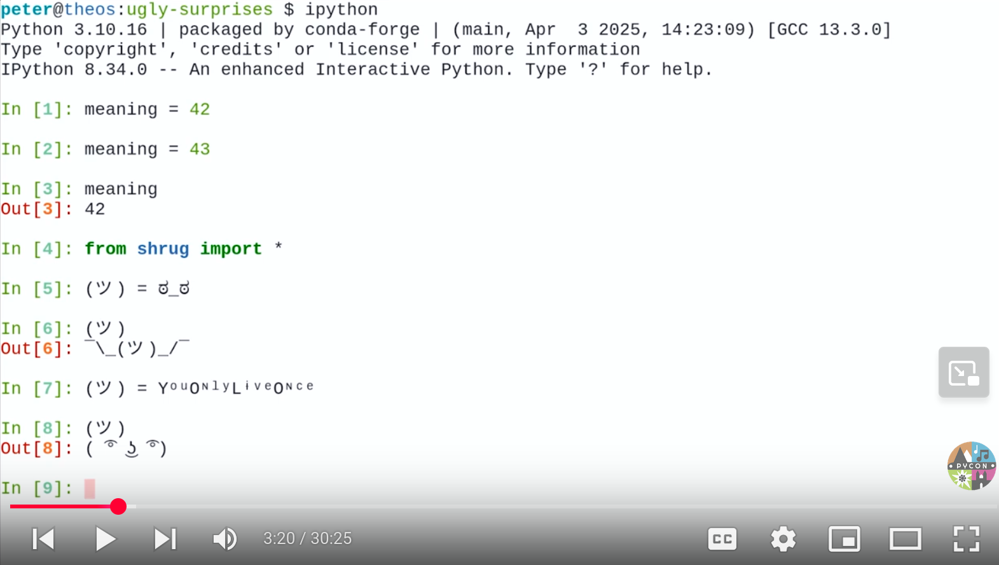

.. |license| image:: https://img.shields.io/github/license/lumbric/ugly-surprises.svg
   :target: https://choosealicense.com/licenses/mit
   :alt: MIT License

Ugly Surprises  |license|
=========================

  Surprises are more ugly than beautiful.
    -- loosely based on PEP 20

Python gotchas and surprising Python facts presented as lightning talk at the `PyDays 2019`_.
Inspired by the `WAT lightning talk by Gary Bernhardt from CodeMash 2012`_. 
This repository contains links to the sources and all the material for the live presentation, as
well as a `PDF`_ with screenshots of the live demo.

The lightning talk was presented again at `PyCon Austria 2025`_.

Recording
---------

.. _`PyDays 2019`: https://www.pydays.at/
.. _`WAT lightning talk by Gary Bernhardt from CodeMash 2012`: https://www.destroyallsoftware.com/talks/wat
.. _`PyCon Austria 2025`: https://pycon.pyug.at/
.. _`PDF`: slides/slides.pdf

Riddles
-------

Not really part of the lightning talk, but kind of related and also collected and
prepared for the PyDays 2019, some mind screwing Python riddles with surprising
solutions. Riddles are available as `PDF <riddles/riddles.pdf>`_ and `SVG
<riddles/riddles.svg>`_.

Links
-----

Talks about crazy facts in other programing languages than Python:

- https://www.destroyallsoftware.com/talks/wat
- https://www.youtube.com/watch?v=tsG95Y-C14k

Mind screwing Python code snippets:

- https://github.com/satwikkansal/wtfpython
- https://www.codementor.io/satwikkansal/some-tricky-python-snippets-that-may-bite-you-off-bhndh45zp
- https://kate.io/blog/2017/08/22/weird-python-integers/
- https://dbader.org/blog/python-mystery-dict-expression
- https://blog.brush.co.nz/2008/01/ten-python-quirkies/
- https://github.com/qezz/python-common-gotchas
- https://www.toptal.com/python/top-10-mistakes-that-python-programmers-make
- https://gist.github.com/brianspiering/6921253524fe0a058d4de8aa0d306c02
- https://www.geeksforgeeks.org/a-b-assignment-riddle-in-python/
- https://www.geeksforgeeks.org/python-a-b-is-not-always-a-a-b/

How to run code snippets
------------------------

To type all the Unicode characters, one can cheat a bit by using doitlive_. The
IPython support is great, but there seems to be a dependency hell. One needs
`prompt-toolkit==1.x` and `5.0<=IPython<7.0`.

To install with conda:

.. code:: bash

    $ conda env update -f env-frozen.yml
    $ conda activate ugly-surprises
    $ cd presentation
    $ PYTHONPATH=$(pwd)/.. doitlive play -q presentation-part2-unicode.sh

.. _doitlive: https://doitlive.readthedocs.io/en/stable/

In 2025 `pixi`_ has been used instead of conda:

.. code:: bash

    $ pixi shell
    $ doitlive play -q presentation-part2-unicode.sh

.. _`pixi`: https://pixi.sh/

The automatic shell completion can be disruptive, so it is disabled by adding the following
lines to ``~/.ipython/profile_default/ipython_config.py``:

.. code:: python

    c = get_config()  #noqa
    c.TerminalInteractiveShell.autosuggestions_provider = None

A warning is displayed by doitlive when using the gnome-terminal. Neither filtering the warning nor
using a different terminal emulator works, so the warning is disabled by removing it from the
source code in the ``.pixi`` environment:

.. code:: diff

    --- .pixi/envs/default/lib/python3.10/site-packages/prompt_toolkit/application/application.py
    +++ .pixi/envs/default/lib/python3.10/site-packages/prompt_toolkit/application/application.py-patched
    @@ -1238,9 +1238,9 @@
                 return  # We know about this already.
     
             def in_terminal() -> None:
    -            self.output.write(
    -                "WARNING: your terminal doesn't support cursor position requests (CPR).\r\n"
    -            )
                 self.output.flush()
     
             run_in_terminal(in_terminal)

Presentation
------------

See `notes.rst <presentation/notes.rst>`_ for detailed content of the presentation.

8 workspaces need to be prepared:

- Screen 1: eog `white.png <presentation/white.png>`_
- Screen 2: eog `ugly-surprise.jpg <presentation/ugly-surprise.jpg>`_
- Screen 3: eog `ugly-surprise-with-title.png <presentation/ugly-surprise-with-title.png>`_
- Screen 4: ipython or doitlive play -q `presentation-part1.sh <presentation/presentation-part1.sh>`_
- Screen 5: doitlive play -q `presentation-part2-unicode.sh <presentation/presentation-part2-unicode.sh>`_
- Screen 6: vi `mandelbrot.py <presentation/mandelbrot.py>`_
- Screen 7: `mandelbrot.png <presentation/mandelbrot.png>`_
- Screen 8: `mandelbrot-with-text.png <presentation/mandelbrot-with-text.png>`_

The presentation is done by switching from one workspace screen to the next one. Screen 4 can be
typed live or by using doitlive. Screen 5 contains unicode characters, so one needs to use
doitlive.

The `slides/slides.pdf`_ contains screenshots of the live presentation, which can be used as a backup.

.. _`slides/slides.pdf`: slides/slides.pdf

Surprising code snippets not (yet) used here
--------------------------------------------

Numpy seems to use `partial pairwise summation in some cases <https://numpy.org/doc/stable/reference/generated/numpy.sum.html>`_, which can lead to different results depending on the data type used:

.. code:: python

    >>> import numpy as np
    >>> data = [0.042411500823462206, 0.5387831400906496,
                2.0907299109640074, 0.012566370614359173, 0.5387831400906496,
                0.10053096491487339, 0.5387831400906496, 0.10053096491487339,
                0.8042477193189871, 0.1963495408493621, 1.1451105222334796,
                1.1451105222334796]
    >>> np.sum(np.array(data, dtype=object)) - np.sum(np.array(data, dtype=float))
    8.881784197001252e-16

Unrelated mathematical surprises
--------------------------------

Interesting mistakes and surprises without Python:

- `Proof for 3 = 0 <https://www.youtube.com/watch?v=SGUZ-8u1OxM>`_
- `What Happens When Math Goes wrong? with Matt Parker <https://www.youtube.com/watch?v=6JwEYamjXpA>`_
- `All Numbers are Describable in at Most Twenty Words <https://jeremykun.com/2011/07/28/false-proof-twenty-word/>`_ `(more false proofs) <https://jeremykun.com/proof-gallery/>`_
